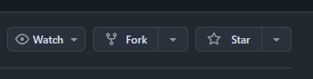
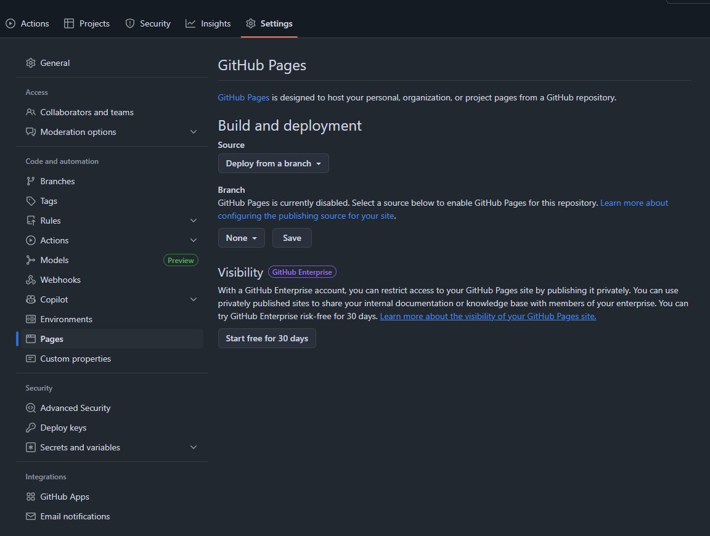
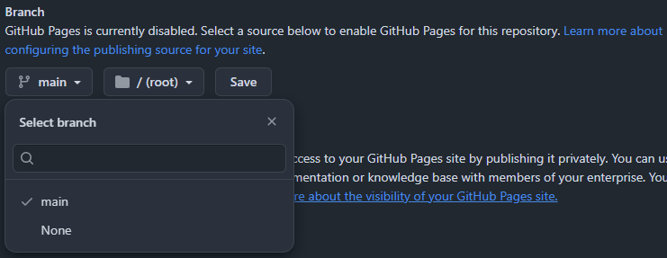
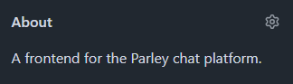

# GitHub Pages

How to host a free frontend instance using GitHub Pages

**1. Go to GitHub Mura repository**

[https://github.com/parley-chat/Mura](https://github.com/parley-chat/Mura)

{: .important }
You need a GitHub account, if you don't have you create one.

**2. Fork the repository**

Press the "Fork" button.

and press the "Create fork" button, no settings need to be changed.

**3. Setup GitHub Pages**

Go to "Settings" then "Pages"

Under "Branch" change "None" to "Main" and save.

**4. Go to main repository page**

Go to the repository's main page and edit the about properties.

**5. Check "Use your GitHub Pages website"**

Save changes.

**6. Wait**

It should take about a minute, after it has correctly built the site just press the url under the "About" section.